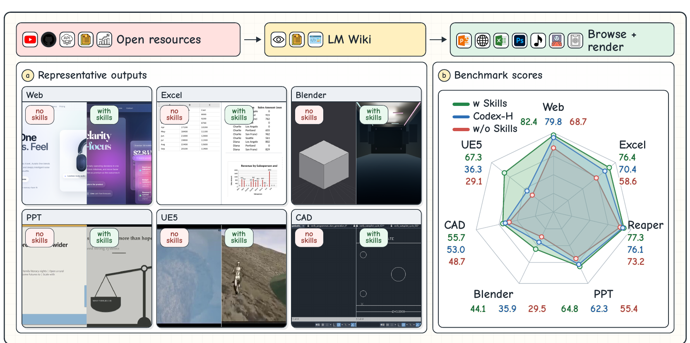

# RESOURCE2SKILL: Distilling Executable Agent Skills from Human-Created Multimodal Resources

[](https://microsoft.github.io/Resource2Skill/)
[](https://arxiv.org/abs/2606.29538)
[](https://github.com/microsoft/Resource2Skill)
[](https://huggingface.co/datasets/microsoft/RESOURCE2SKILL)

<p align="center">
  
</p>

This repository is the official Microsoft open-source release of Resource2Skill.

Resource2Skill turns human-created resources (tutorial videos, reference
artifacts, articles, code) into reusable executable skills that a software agent
can browse, compose, and run through real software tools — producing Web pages,
PowerPoint decks, Excel workbooks, Blender scenes, and REAPER-style audio.

It contains the **runnable runtime + skill libraries**. Get started below.

## Installation

Use **Python 3.11** in a fresh virtual environment.

```bash
python3.11 -m venv .venv
source .venv/bin/activate
python -m pip install --upgrade pip
python -m pip install -r requirements.txt
```

`requirements.txt` covers the core runtime plus the Web, PowerPoint, Excel, and
REAPER dependencies (`mcp` is pinned to `>=1.26`). Then add the per-domain system
dependencies you need:

- **Web** — `python -m playwright install chromium`
- **PowerPoint** — install **LibreOffice** (`soffice`) for deck rendering
- **REAPER-style audio** — install **`fluidsynth`** + a General MIDI soundfont,
  then set `VWS_REAPER_SOUNDFONT=/path/to/soundfont.sf2`
- **Blender** — `pip install bpy` (headless Blender as a module; needs Python 3.11)

## Model Configuration

```bash
cp .env.example .env
```

Fill in your provider settings (Azure OpenAI shown):

```text
AZURE_OPENAI_ENDPOINT=https://<your-resource>.openai.azure.com/
AZURE_OPENAI_API_KEY=<your-key>
# or, if your resource uses Entra ID / AAD instead of keys:
# AZURE_OPENAI_USE_AAD=1
```

Per-model overrides (e.g. `AZURE_OPENAI_ENDPOINT_54`, `AZURE_OPENAI_DEPLOYMENT_54`)
are in `.env.example`.

## Quick Start

```bash
# list domains, then validate the one you want (web | ppt | excel | blender | reaper)
python cli.py domains
python cli.py validate-domain --domain web

# run a case
python cli.py agent \
  --domain web \
  --task "Build a one-page landing site for a neighborhood arts nonprofit called Quartz. Warm hand-made editorial style; programs, impact, donation tiers, FAQ, footer. Save and STOP." \
  --model gpt-5.4 --reasoning low --max-iter 40
```

Generated files land in `demo/<domain>/`. More prompts: `examples/case_prompts.json`.

## Examples per Domain

PowerPoint (PPT Master — SVG-first, editable `.pptx`; ask for the PPT Master backend explicitly):

```bash
python cli.py agent --domain ppt \
  --task "Use the PPT Master SVG-first backend. Call pptmaster_select_r2s_refs first, read each chosen skill's svg_recipe as your scaffold, then build an 8-slide strategy deck for a renewable-energy startup called Dune Renewables. Record design_refs on every slide and export to .pptx. Save and STOP." \
  --model gpt-5.5 --reasoning medium --max-iter 80 --n-skills 12 --top-k 80
```

Excel:

```bash
python cli.py agent --domain excel \
  --task "Build a 4-sheet manufacturing defects workbook (Summary, Defect Log, Products, Production Lines) with realistic data, formulas, tables, and one summary chart. Save and STOP." \
  --model gpt-5.4 --reasoning low --max-iter 50
```

Blender (needs the Python 3.11 + `bpy` setup):

```bash
python cli.py agent --domain blender \
  --task "Build a moody product hero scene with stacked books and a lit candle on a tabletop. Warm side lighting, realistic materials, close editorial camera. Save and STOP." \
  --model gpt-5.4 --reasoning low --max-iter 60
```

REAPER-style audio:

```bash
python cli.py agent --domain reaper \
  --task "Compose a 24-bar psychedelic rock track in G minor at 150 BPM with drums, bass, harmonic instrument, lead, arrangement sections, and a rendered WAV. Save and STOP." \
  --model gpt-5.4 --reasoning low --max-iter 80
```

## Skills & Dataset

The distilled skill libraries are released on Hugging Face:

**https://huggingface.co/datasets/microsoft/RESOURCE2SKILL**

At runtime the agent reads from two roots in this repo: `skills_wiki/<domain>/`
(structured wiki entries for browse/search/inspect) and `skills_library/<domain>/`
(executable assets used by the domain MCP servers).

## Citation

```bibtex
@misc{fan2026resource2skill,
  title         = {{RESOURCE2SKILL}: Distilling Executable Agent Skills from Human-Created Multimodal Resources},
  author        = {Yijia Fan and Zonglin Di and Zimo Wen and Yifan Yang and Mingxi Cheng and Qi Dai and Bei Liu and Kai Qiu and Yue Dong and Ji Li and Chong Luo},
  year          = {2026},
  eprint        = {2606.29538},
  archivePrefix = {arXiv},
  primaryClass  = {cs.SE},
  url           = {https://arxiv.org/abs/2606.29538}
}
```

## License

Released under the MIT License. See `LICENSE`.
