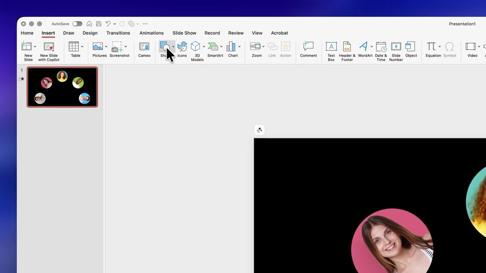
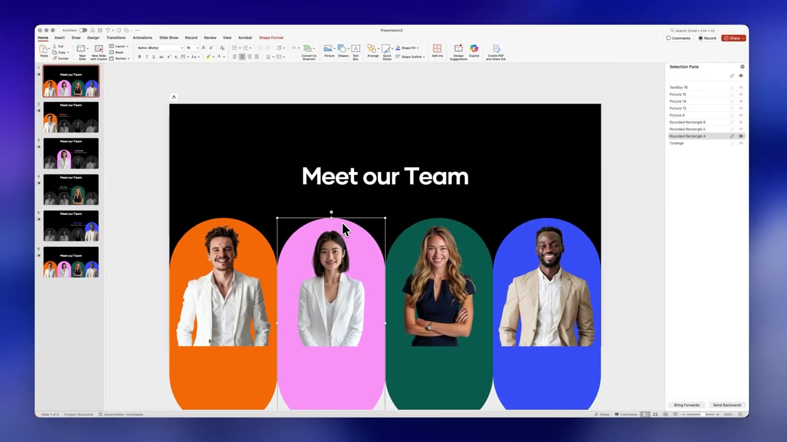

# Visual Breakdown

* **Step A: Core Visual Elements**
  - **Shapes**: Stadium shapes (perfectly rounded rectangles/capsules) serving as both the background frame and the portrait mask.
  - **Color Logic**:
    - Background: Deep Black `(0, 0, 0, 255)`
    - Active Accent: Vibrant Magenta/Pink `(236, 64, 122, 255)` or custom brand color.
    - Inactive Base: Dark Charcoal `(40, 40, 40, 255)`
  - **Text Hierarchy**: Large geometric sans-serif title (White). Highlighted subject name is bold and colored to match the accent, with a smaller, light gray subtitle for the role.

* **Step B: Compositional Style**
  - **Layout**: Four columns distributed evenly across the 16:9 canvas. 
  - **Proportions**: Inactive cards occupy roughly 18% of the slide width each. The active card expands to ~22% and breaks the vertical rhythm by rising higher into the negative space.
  - **Anchoring**: All cards align towards the bottom but extend below the visible canvas edge, masked by a 2.5-inch gradient overlay.

* **Step C: Dynamic Effects & Transitions**
  - **Morph Transition**: Duplicating this slide, shifting the active state to the next person, and applying PowerPoint's Morph transition creates an incredibly smooth "carousel" rolling effect (which the user must trigger manually in PPT, but the code generates the perfect starting/ending keyframes).

---

## Visual References

Frames extracted from the source video, each grounded to a stage of the visual pattern:

-  — `t=142s`
-  — `t=284s`
-  — `t=427s`
-  — `t=569s`

See also: [`reference_render.png`](../visual/reference_render.png) — what the code produces.
